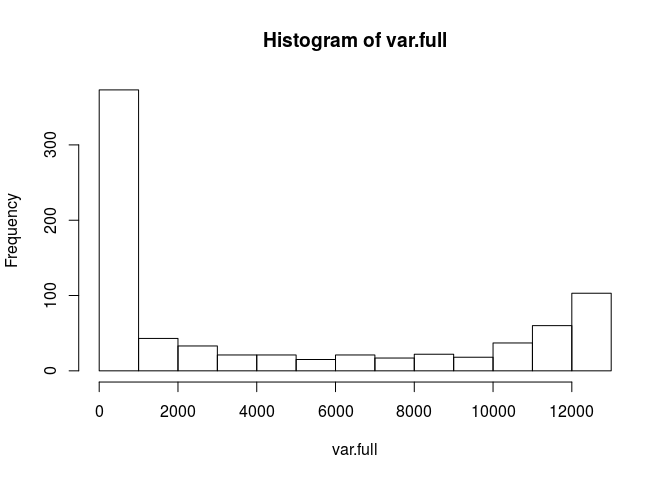
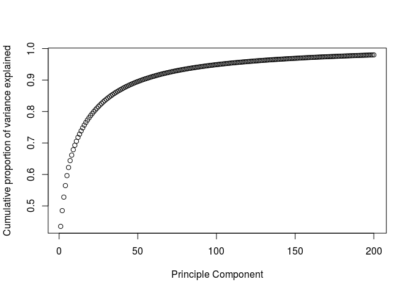

# Digit_Recognizer_SVM
rj  
October 10, 2017  


## Overview

This is a Kaggle competition using the MNIST dataset of handwritten images of digits.
The goal of the competition is to correctly identify digits from handwritten images.


The data files train.csv and test.csv contain gray-scale images of hand-drawn digits, from zero through nine.

Each image is 28 pixels in height and 28 pixels in width, for a total of 784 pixels in total. 
Each pixel has a single pixel-value associated with it, indicating the lightness or darkness of that pixel, with higher numbers meaning darker. 
This pixel-value is an integer between 0 and 255, inclusive.

The data set consists of 785 columns.
The first column is labeled 'label' and is the digit that was drawn by the user.
The remaining columns contain the pixel-values of the associated image.
Each pixel column in the training set has a name like pixelx, where x is an integer between 0 and 783, inclusive. 
To locate this pixel on the image, suppose that we have decomposed x as x = i * 28 + j, where i and j are integers between 0 and 27, inclusive. 
Then pixelx is located on row i and column j of a 28 x 28 matrix, (indexing by zero).


## Data Preprocessing


```r
digits.train<-read.csv("train.csv")
digits.test<-read.csv("test.csv")
```


```r
dim(digits.train)
```

```
## [1] 42000   785
```

```r
dim(digits.test)
```

```
## [1] 28000   784
```


In an initial pass over, the pixel values were normalized between [0,1] by dividing by the maximum value that it can take on (255).
After more work, it was decided to not do this, however the linear kernel submitted to Kaggle.com did have this normalization procedure.

```r
labels.train<-as.factor(digits.train[,1])
#pixels.train<-digits.train[,2:785]/255
#pixels.test<-digits.test[,1:784]/255
pixels.train<-digits.train[,2:785]
pixels.test<-digits.test[,1:784]
pixels.full<-rbind(pixels.train,pixels.test)
```

Since we also have $p=784$ features in our data set we will want to reduce the dimensionality of our data set, so we can look at the variance of any given feature to determine which features have low variance and remove those features as they will not be useful to the model.
We can make a histogram of the variance of each feature and we see that there are ~400 features with near zero variance by inspection.

```r
var.full<-sapply(1:784,function(x) var(pixels.full[,x]))
hist(var.full)
```

<!-- -->

We will want to remove these features which have zero variance since they are constant for all observations and will not help the model.


```r
sum(var.full==0)
```

```
## [1] 65
```

```r
pixels.reduced.full=pixels.full[,var.full>0]
dim(pixels.reduced.full)
```

```
## [1] 70000   719
```


We still have a large dimensionality in the data set, so we will now use PCA to lower the dimensionality of the data.
This will find linear combinations of the features which account for the most variance.


```r
PCA.pixels.full<-prcomp(pixels.reduced.full,scale=FALSE,center=FALSE)
```

The plot below shows that once we get to the 50th or so moment, we account for 90% of the variance among the features.  In the analysis below, we will use the first 75 moments.

```r
PCA.pixels.full.var<-(PCA.pixels.full$sdev)^2
PCA.pixels.full.var.pro<-PCA.pixels.full.var/sum(PCA.pixels.full.var)
plot(cumsum(PCA.pixels.full.var.pro[1:200]),xlab="Principle Component",ylab="Cumulative proportion of variance explained")
```

<!-- -->


```r
pixels.full.rot<-as.matrix(pixels.reduced.full) %*% PCA.pixels.full$rotation[,1:75]
full.rot<-data.frame(pixels.full.rot)

train.rot<-full.rot[1:42000,]
test.rot<-full.rot[42001:70000,]
train.rot=data.frame(labels.train,train.rot)
colnames(train.rot)[1]<-"label"
```


We are also going to separate the training set into a set to train on with the first 35k points to evaulate the model on the remaining 7k points.


```r
train.rot.train=train.rot[1:35000,]
train.rot.val=train.rot[35001:42000,]
```


## Using SVM to fit the model

We will now make a SVM model to attempt to predict digits.


We are going to start by looking at a subset of the training data and seeing how well we can do on the remaining bit to validate our model.


```r
#note: this takes a very long time to run
#tuning.svm.lin<-tune.svm(label~., data=train.rot.train, kernel="linear", cost=c(.05,.1,.5,1,3))
#tuning.svm.poly<-tune(svm,label~.,data=train.rot,kernel="polynomial",ranges=list(cost=c(1,10,50),gamma=c(.1,1,10),coef0=c(1)),degree=3)
```


```r
#summary(tuning.svm.lin)
#summary(tuning.svm.poly)
```


Output from summary(tuning.svm.lin):
Parameter tuning of ‘svm’:

- sampling method: 10-fold cross validation 

- best parameters:
 cost
  0.1

- best performance: 0.06394286 

- Detailed performance results:
  cost      error  dispersion
1  0.1 0.06394286 0.003608506
2  1.0 0.06548571 0.003282055
3 10.0 0.06711429 0.003063796


Output from summary(tuning.svm.poly):
Parameter tuning of ‘svm’:

- sampling method: 10-fold cross validation 

- best parameters:
 cost gamma coef0
    1   0.1     1

- best performance: 0.01938095 

- Detailed performance results:
  cost gamma coef0      error  dispersion
1    1   0.1     1 0.01938095 0.001676840
2   10   0.1     1 0.01938095 0.001676840
3   50   0.1     1 0.01938095 0.001676840
4    1   1.0     1 0.02264286 0.001703856
5   10   1.0     1 0.02264286 0.001703856
6   50   1.0     1 0.02264286 0.001703856
7    1  10.0     1 0.02430952 0.001814842
8   10  10.0     1 0.02430952 0.001814842
9   50  10.0     1 0.02430952 0.001814842

We use this information to select (cost=1) for the linear kernel and (cost=1,gamma=0.1) for the polynomial kernel.


We will now check how the SVM model does against the validation part of the training data that we have set aside to see what our accuracy is with new data.
We find that we get about 94% accuracy with a linear kernel and about 98% accuracty with a 3rd degree polynomial kernel, which is pretty good.


```r
svmfit.lin<-svm(label~., data=train.rot.train, kernel="linear", cost=1.0)
svm.pred.lin.val<-predict(svmfit.lin,newdata=train.rot.val)
table(svm.pred.lin.val,train.rot.val$label)
```

```
##                 
## svm.pred.lin.val   0   1   2   3   4   5   6   7   8   9
##                0 699   0   5   5   0   7   6   1   4   5
##                1   0 771   4   3   5   6   2   2  12   3
##                2   5   1 622  10   4   7   7   9   5   2
##                3   0   2   7 682   0  20   1   3  10   9
##                4   2   1   6   1 668   6   2   2   3  19
##                5   1   1   8  12   0 529   6   2  10   3
##                6   4   0   5   2   4   7 685   0   1   0
##                7   0   1   3   4   5   0   0 688   2  19
##                8   5   4   9   6   4  12   2   3 637   6
##                9   0   0   2   4  15   6   0   9   3 615
```

```r
sum(svm.pred.lin.val==train.rot.val$label)/7000
```

```
## [1] 0.9422857
```

```r
svmfit.poly<-svm(label~.,data=train.rot.train,kernel="polynomial",cost=1,degree=3,coef0=1,gamma=0.1)
svm.pred.poly.val<-predict(svmfit.poly,newdata=train.rot.val)
table(svm.pred.poly.val,train.rot.val$label)
```

```
##                  
## svm.pred.poly.val   0   1   2   3   4   5   6   7   8   9
##                 0 710   0   7   0   2   2   1   0   1   5
##                 1   1 775   2   2   6   0   2   2   2   0
##                 2   0   1 652   5   1   0   0   4   4   2
##                 3   0   0   3 712   0   6   0   0   3   1
##                 4   0   1   1   0 688   2   2   1   2   7
##                 5   0   0   0   5   0 583   1   0   3   2
##                 6   4   0   1   0   0   3 705   0   3   0
##                 7   1   1   2   1   1   0   0 709   0   6
##                 8   0   3   1   1   2   1   0   1 666   0
##                 9   0   0   2   3   5   3   0   2   3 658
```

```r
sum(svm.pred.poly.val==train.rot.val$label)/7000
```

```
## [1] 0.9797143
```


Now we want to combine all the training data to create an SVM model which we will use on our test set to submit to Kaggle.com.


```r
svmfit.full.lin<-svm(label~., data=train.rot, kernel="linear", cost=.1)
svm.pred.lin<-predict(svmfit.full.lin,newdata=test.rot)
svm.pred.lin<-as.data.frame(svm.pred.lin)
```


```r
svmfit.full.poly<-svm(label~.,data=train.rot,kernel="polynomial",cost=1,degree=3,coef0=1,gamma=0.1)
svm.pred.poly<-predict(svmfit.full.poly,newdata=test.rot)
svm.pred.poly<-as.data.frame(svm.pred.poly)
```


```r
labels.test<-as.factor(c(1:28000))
test.out.lin<-data.frame(labels.test,svm.pred.lin)
test.out.poly<-data.frame(labels.test,svm.pred.poly)
colnames(test.out.lin)<-c("ImageId","Label")
colnames(test.out.poly)<-c("ImageId","Label")
write.csv(test.out.lin,file="submission_svm_lin.csv",row.names=F,quote=F)
write.csv(test.out.poly,file="submission_svm_poly.csv",row.names=F,quote=F)
```


Output for the polynomial kernel yields a score of .98228 on Kaggle.com, while the linear kernel only achieves a score of .93585 (this is after scaling pixels to have values between [0,1] and may be slightly different unscaled).


